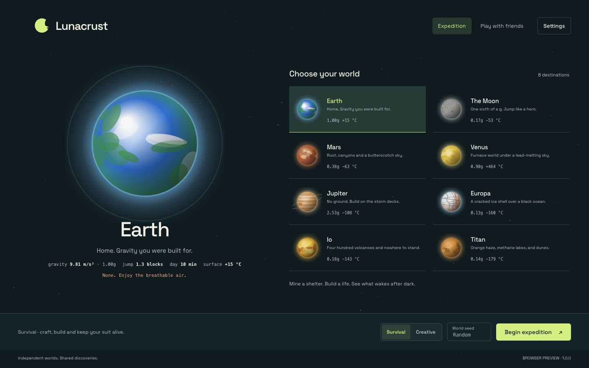

# Lunacrust

**An expedition of your own.** An open-source desktop voxel sandbox across eight Solar System worlds. Mine a shelter, build a base, craft life support and face strange creatures together with friends on the same Wi-Fi.



## Play

The current release candidate is available in the [verified CI artifacts](https://github.com/HonzaCuhel/Lunacrust/actions/runs/33927997741). A signed public release is still pending; see [release status](docs/RELEASE_STATUS.md). Choose the package for your computer:

| Computer | Package | Install |
| --- | --- | --- |
| Mac with Apple Silicon | `Lunacrust-1.0.0-mac-arm64-unsigned.dmg` | Open the DMG and drag Lunacrust into Applications. |
| Mac with Intel processor | `Lunacrust-1.0.0-mac-x64-unsigned.dmg` | Open the DMG and drag Lunacrust into Applications. |
| Windows x64 | `Lunacrust-1.0.0-win-x64-unsigned.exe` | Run the installer; no Node.js needed. |
| Ubuntu / Debian x64 | `Lunacrust-1.0.0-linux-amd64.deb` | Open with your software installer, or use `sudo apt install ./Lunacrust-1.0.0-linux-amd64.deb`. |
| Other Linux x64 | `Lunacrust-1.0.0-linux-x86_64.AppImage` | Make executable and run on a system that supports Chromium's sandbox. This format has not had a native runtime check. |

The DEB includes installer setup for the Chromium sandbox and an application-specific AppArmor profile, relevant on Ubuntu systems that restrict unprivileged user namespaces. AppImage and unpacked launches do not run that installer. The DEB was installed and its sandboxed application tested on Ubuntu 24.04 in native CI; see [packaging verification](docs/PACKAGING_VERIFICATION.md) for the precise platform coverage.

Package availability and actual verification are recorded in [release status](docs/RELEASE_STATUS.md). Local builds are unsigned unless the publisher supplies signing credentials. macOS may require approval in **System Settings → Privacy & Security** after opening; a downloaded unsigned app does not have the seamless Gatekeeper experience of a signed, notarized release. Windows may display an unknown-publisher prompt. Only open artifacts you trust. Never disable system security globally.

Lunacrust needs a keyboard, mouse/trackpad and WebGL2-capable graphics. The menu supports 960×600 and larger windows. Try a lower render distance and resolution scale in Settings on integrated graphics. No account or internet connection is needed once installed.

## Play on the same Wi-Fi

1. Everyone opens the **same version** of the desktop app and connects to the same private Wi-Fi or wired LAN.
2. The host chooses a planet, starts an expedition, presses **Esc**, then **Open to LAN**.
3. Other players choose **Play with friends** and select the discovered expedition. If discovery is unavailable, use **Direct connect** with the host's address and port displayed in the pause menu.
4. Keep the host's app open. The host owns the world; each guest saves their own character separately. Leaving or the host closing returns guests to orbit.

Shared blocks, player avatars, hostile creatures, dropped loot, time and smelters are synchronized. One player at a time operates a smelter. In co-op the world continues while a menu is open, so find shelter before pausing. Chat is in the pause-menu player list. A maximum of eight players includes the host.

Allow Lunacrust through the firewall on **private networks**. Access-point/client isolation on a guest Wi-Fi may prevent devices from communicating; use the normal home network. The default TCP game port is 25710 and discovery uses UDP 25718; use the address and port displayed by the host for direct connections. No router port forwarding is needed. This is trusted-LAN co-op, not an internet-hosting service or a cheat-resistant competitive server. The browser preview supports single-player only.

## The expedition

Choose **Survival** for crafting, health, energy, suit oxygen and hostile wildlife. You land with a drill, fabricator, rations, oxygen canisters and lamps. Mine rock, make tools, smelt materials, and build life support. Recipes accept local rock across planets. **Creative** gives unlimited materials, flight and immunity to damage.

| World | What to expect |
| --- | --- |
| Earth | Forests, oceans, familiar gravity and breathable air. The easiest start. |
| The Moon | Craters and enormous low-gravity jumps; bring oxygen. |
| Mars | Rust-colored canyons, ice and dust storms. |
| Venus | Volcanic ground, dense haze and lava seas. |
| Jupiter | Fictional storm decks suspended above a lethal void. |
| Europa | Cracked ice and Jupiter overhead. |
| Io | Sulfur plains and volcanic spires. |
| Titan | Methane lakes and alien canopies. |

Planet environments and wildlife are fictionalized for play. Gravity changes actual movement and fall damage. At night or underground, beware the **Flux Skitter**, a six-legged volatile alien that charges before bursting, and the **Basalt Resonator**, a mineral tripod with a telegraphed slam. Retreat, use terrain or improve your tools and suit.

## Controls and settings

| Input | Action |
| --- | --- |
| WASD / arrows | Move |
| Space | Jump; double-tap to fly in creative |
| Shift / Ctrl | Sneak or descend / sprint |
| Left mouse | Mine or strike a creature |
| Right mouse | Place; interact with a station; use held supplies |
| Middle mouse | Pick a block in creative |
| 1–9 / mouse wheel | Select hotbar slot |
| E | Inventory/crafting or creative palette |
| F / L / R | Creative flight / helmet lamp / creative respawn |
| Esc | Pause, settings, LAN, save and return |
| F3 / F11 | Debug information / desktop fullscreen |

Settings are available before landing and from pause: render distance, field of view, sensitivity, resolution scale, inversion, reduced menu motion, independent music/effects levels and explorer name. Changes apply immediately and persist locally. Restore defaults is available if an old configuration behaves badly.

## Saves

Desktop saves are JSON files inside the OS's Lunacrust user-data directory (`~/Library/Application Support/Lunacrust/saves` on macOS). Writes are atomic, serialized and keep a previous backup. Compatible legacy desktop saves are copied on first launch without overwriting either version. Browser saves stay in that browser's local storage. Keep backups before moving to a different device or version. A guest character is keyed by the hosted world's unique ID and cannot replace your single-player planet save.

## Build from source

Use Node.js 22.17 or newer and npm:

```sh
npm ci
npm start
```

For browser development, `npm run web` opens a local server at `http://127.0.0.1:5178`. Three.js is vendored from the pinned dependency on installation, so the game makes no CDN requests. Fonts and audio ship locally.

```sh
npm test                 # deterministic mechanics, network, settings and storage tests
npm run probe:lan        # three actual Electron instances, isolated temporary saves
node tools/probe-capacity.js dist/mac-arm64/Lunacrust.app # packaged host + seven TCP guests
npm run probe:survival   # native survival mechanics
node tools/check-ui.mjs  # running dev server + installed Chrome required
npm run verify:bundle   # isolated native startup and local-asset checks
npm run dist:mac        # DMG build
npm run dist:linux      # Linux distributions
npm run dist:win        # Windows installer (native Windows recommended)
node tools/make-soundtrack.js  # regenerate the original score
```

See [release instructions](docs/RELEASING.md) for platform CI, signing, checksums and source archives. Probes use temporary user-data directories; they must never run against your normal saved games.

## Open source and credits

Game code and original generated assets are available under the [MIT license](LICENSE). Space Grotesk uses the SIL Open Font License; Three.js, Electron and their dependencies retain their notices. See [asset provenance](docs/ASSET_PROVENANCE.md) and [third-party notices](THIRD_PARTY_NOTICES.md).

Lunacrust is independent and is not affiliated with Mojang or Microsoft. The source audit reduces identifiable copying/provenance risks; it is not a trademark clearance or a guarantee against legal claims. See the provenance document for what was checked and the limits of the evidence.

Bug reports should include OS, game version, mode, planet, reproducible steps and a save copy when appropriate. Do not include private data or credentials. See [contributing](CONTRIBUTING.md).
